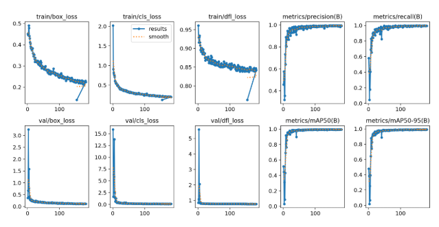
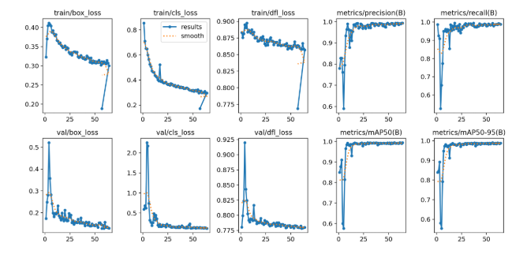
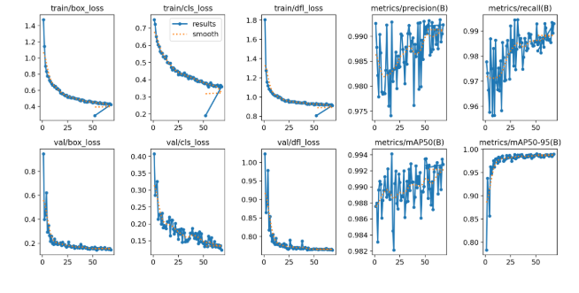
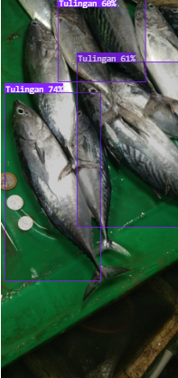
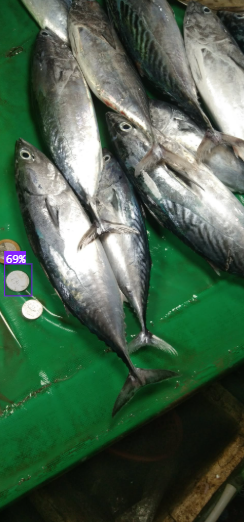
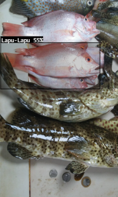
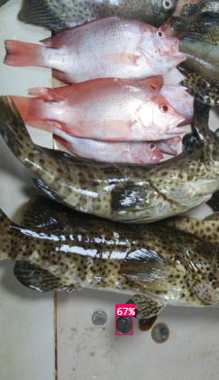

# TakeAFish Backend

This repository contains the backend code for the TakeAFish application, which provides fish species identification and age estimation based on uploaded images. The application is built using Flask and leverages pre-trained models for image recognition.

## Project Structure

```
.
├── services
│   ├── utils.py        # Utility functions for image processing and model inference
│   ├── config.py       # Configuration parameters for fish species
│   └── species.py      # Fish species identification and age estimation logic
├── static
├── templates           # HTML templates for Flask
├── uploads
├── .env                # Environment variables for API keys and model IDs
├── .gitignore 
├── app.log             # Log file for application events
├── README.md 
├── render.yaml         # Deployment configuration for Render.com
├── requirements.txt    # Python dependencies
├── runtime.txt         # Python runtime version
└── server.py           # Main Flask application
```

## Setup Instructions

1. Clone the repository to your local machine.
2. Navigate to the project directory.
3. Create a virtual environment and activate it:
  - **On Windows:**
    ```
    python -m venv TAKEAFISHB
    .\TAKEAFISHB\Scripts\activate
    ```
  - **On macOS/Linux:**
    ```
    python3 -m venv TAKEAFISHB
    source TAKEAFISHB/bin/activate
    ```
4. Install the required packages:
  ```
  pip install -r requirements.txt
  ```
5. Create a `.env` file in the root directory and add your environment variables (refer to the provided `.env` template).
6. Run the server:
  ```
  python server.py
  ```

## Usage

1. Open your web browser and navigate to `http://localhost:8000`.
2. Use the web interface to upload images and view results.

**Routes:**
- `/` : Home page with upload form
- `/upload` : Endpoint to handle image uploads and return results

## Deployment in Render

```
Option 1: Deploy on Render.com using the provided `render.yaml` configuration file. Follow Render.com's documentation for deployment steps.
Option 2: Alternatively, specify the Python version in the environment tab of Render.com.
```

## Logging

The application logs events to `app.log` for monitoring and debugging purposes.

## Environment Variables

- `API_KEY`: Your API key for the image recognition service.
- `MODEL_ID`: The model ID for fish species identification.
- `REFERENCE_API_KEY`: API key for reference object detection.
- `COIN_MODEL_ID`: Model ID for reference object detection.
- `GOOGLE_SHEETS_CREDENTIALS`: Path to your Google Sheets API credentials JSON file.

## Fish Species Datasets

The fish species datasets used in this project are sourced from the following. The Cherry Blossom and Sakura Tree datasets are custom derivatives created for this project, originating from the following public datasets:

### 1. Fish Classification Dataset

- **Source:** [Roboflow Universe](https://universe.roboflow.com/da-project/fish-classification-jwegt)
- **Author:** DA Project
- **License:** CC BY 4.0
- **Citation:**
  ```
  @misc{fish-classification-jwegt_dataset,
   title = {Fish Classification Dataset},
   author = {DA Project},
   howpublished = {\url{https://universe.roboflow.com/da-project/fish-classification-jwegt}},
   year = {2025},
   month = {sep},
   note = {visited on 2025-09-19}
  }
  ```

### 2. Fish-gres Dataset for Fish Species Classification

- **Source:** [Mendeley Data](https://data.mendeley.com/datasets/76cr3wfhff/1)
- **Authors:** Prasetyo, Eko; Suciati, Nanik; Fatichah, Chastine
- **License:** CC BY 4.0
- **Citation:**
  ```
  Prasetyo, Eko; Suciati, Nanik; Fatichah, Chastine (2021), “Fish-gres Dataset for Fish Species Classification”, Mendeley Data, V1, doi: 10.17632/76cr3wfhff.1
  ```

### 3. Fish-pYTORCH Dataset

- **Source:** [Roboflow Universe](https://universe.roboflow.com/fish-befuh/fish-pytorch-phb1f)
- **Author:** Fish
- **License:** CC BY 4.0
- **Citation:**
  ```
  @misc{fish-pytorch-phb1f_dataset,
   title = {Fish-pYTORCH Dataset},
   author = {Fish},
   howpublished = {\url{https://universe.roboflow.com/fish-befuh/fish-pytorch-phb1f}},
   year = {2025},
   month = {may},
   note = {visited on 2025-09-19}
  }
  ```

### 4. Fish Dataset

- **Source:** [Kaggle](https://www.kaggle.com/datasets/markdaniellampa/fish-dataset/data)
- **Authors:** Mark Daniel Lampa, Rose Claire Librojo, Mary Mae Calamba
- **License:** Community Data License Agreement – Sharing, Version 1.0
- **Citation:**
  ```
  @misc{mark_daniel_lampa_rose_claire_librojo_mary_mae_calamba_2022,
   title={Fish Dataset},
   url={https://www.kaggle.com/dsv/4323384},
   DOI={10.34740/KAGGLE/DSV/4323384},
   publisher={Kaggle},
   author={Mark Daniel Lampa and Rose Claire Librojo and Mary Mae Calamba},
   year={2022}
  }
  ```

### 5. Cherry Blossom Dataset (Custom)

- **Origin:** Derived from the Fish Classification, Fish-gres, Fish-pYTORCH, and Fish datasets.
- **Images:** 7,920 training, 2,264 validation, 1,136 testing.
- **Preprocessing:** Auto-orient and stretch to 640x640.
- **Model:** YOLOv11 FastCheckpoint (COCO)
  - mAP@50: 98.1%
  - Precision: 97.9%
  - Recall: 97.3%
- **Note:** 5th alteration of my model training; in this model I used 5 species unlike the previous models which used 3 species. In this model, I made a mistake by not early stopping around 100 epochs, which shows in the graph that stagnated around 100 epochs.


### 6. Sakura Tree Dataset (Custom)

- **Origin:** Derived from the Fish Classification, Fish-gres, Fish-pYTORCH, and Fish datasets.
- **Purpose:** Designed to address confusion between lapu-lapu and tilapia.
- **Augmentation:** 2x rotation for orientation robustness.
- **Model:** YOLOv11 Accurate
  - mAP@50: 97.8%
  - Precision: 97.6%
  - Recall: 96.7%
- **Note:** Early stop because the model stagnated around 30 epochs and continued until 100 epochs. This is based on my previous model (Cherry Blossom) which stagnated around 75 epochs. The graph shows stagnation and close training and validation loss, which means the model is not overfitting. Note the unbalanced classes of the dataset.


## Reference Objects Datasets

The reference objects datasets used in this project are derived from the Philippine Money Dataset and are designed to improve reference object detection for fish age and size estimation.

### 1. Philippine Money Dataset

- **Source:** [Roboflow Universe](https://universe.roboflow.com/philippine-money-jczbl/philippine-money-hjn3v)
- **Author:** Philippine Money
- **License:** CC BY 4.0
- **Citation:**
  ```
  @misc{philippine-money-hjn3v_dataset,
   title = {Philippine Money Dataset},
   author = {Philippine Money},
   howpublished = {\url{https://universe.roboflow.com/philippine-money-jczbl/philippine-money-hjn3v}},
   year = {2024},
   month = {sep},
   note = {visited on 2025-09-19}
  }
  ```

### 2. Maple Tree Reference Dataset

- **Origin:** Derived from the Philippine Money Dataset.
- **Images:** 923 training, 271 validation, 132 testing.
- **Preprocessing:** Auto-orient and resize to 640x640.
- **Model:** Early Stop YOLOv11 Accurate Checkpoint (COCOs)
  - mAP@50: 99.4%
  - Precision: 99.0%
  - Recall: 99.4%
- **Note:** Box, Class, and DFL loss (both training and validation) steadily decreased until 50 epochs, meaning the model was still learning. My mistake was not setting early stop to 50 epochs.



### 3. Sakura Tree Reference Dataset

- **Origin:** Derived from the Philippine Money Dataset.
- **Images:** 2,649 training, 271 validation, 132 testing.
- **Preprocessing:** Auto-orient and resize to 640x640.
- **Augmentation:** 90-degree rotation (counter-clockwise, clockwise, upside down) for orientation robustness. Flip horizontal.
- **Model:** YOLOv11 Accurate
  - mAP@50: 99.4%
  - Precision: 99.2%
  - Recall: 98.4%
- **Note:** Box, Class, and DFL loss (both training and validation) steadily decreased until 50 epochs. I decided to stop it at 50.



### 4. Oak Tree Reference Dataset

- **Origin:** Derived from the Philippine Money Dataset.
- **Images:** 2,312 training, 207 validation, 108 testing.
- **Preprocessing:** Auto-orient and resize to 640x640.
- **Augmentation:** 90-degree rotation (counter-clockwise, clockwise, upside down) for orientation robustness. Rotation between -34 to 34 degrees to improve orientation robustness.
- **Model:** YOLOv11 Accurate
  - mAP@50: 99.4%
  - Precision: 99.2%
  - Recall: 99.3%
- **Note:** Box, Class, and DFL loss (both training and validation) steadily decreased until 50 epochs. I decided to stop it at 50.



## Considerations in Cleaning Datasets

- **Fish Species Datasets:**
  - Removed images with multiple fish species to avoid confusion during training.
  - Excluded images which confuse lapu-lapu and tilapia to improve model accuracy.
  - Removed AI-generated images to ensure authenticity.
  - Used Roboflow's duplicate image detection to eliminate duplicates.
  - Concern: overall low number of images for certain species and more populated species like tilapia and bangus. This needs more evaluation.
  - Some classes have augmentation such as random cropping and flipping to improve model robustness. Roboflow augmentation options are restricted/limited.

- **Reference Objects Datasets:**
  - Removed old coins and used new Philippine coins.
  - Used Roboflow's duplicate image detection to eliminate duplicates.
  - Added augmentations to improve model robustness to orientation changes.

## Tools Used

- **Flask:** Web framework for building the backend server.
- **Roboflow:** For dataset management, augmentation, and model training.
- **Python:** For segregating, converting, and cleaning datasets.

## Results

The following examples demonstrate the fish species identification and age estimation process using uploaded images. The results include fish species identification, reference object detection, size estimation, and age estimation.

### Example 1

#### Fish Species Identification



- **Width (px):** 517  
- **Height (px):** 1017  
- **Confidence:** 0.73  
- **Species:** Tulingan

#### Reference Object Detection



- **Coin width (px):** 106  
- **Coin confidence:** 0.69  
- **Coin diameter (cm):** 2.7  
- **Pixels per cm calculation:**  
  ```
  pixels_per_cm = width_px / coin_diameter_cm
               = 106 / 2.7 ≈ 39.25
  ```

#### Size Estimation

- **Width (cm):**  
  ```
  width_cm = width_px / pixels_per_cm
          = 517 / 39.25 ≈ 13.16
  ```
- **Height (cm):**  
  ```
  height_cm = height_px / pixels_per_cm
           = 1017 / 39.25 ≈ 25.90
  ```
- **Length (cm):**  
  ```
  length_cm = max(width_cm, height_cm)
           = ≈ 25.90
  ```

#### Age Estimation

The age estimation uses the von Bertalanffy growth function:

```
t = t0 - (1/K) * ln(1 - (L / L_inf))
```
Where:
- `L` = observed length (cm)
- `L_inf` = asymptotic maximum length (from config.py)
- `K` = growth coefficient (from config.py)
- `t0` = theoretical age at length zero (from config.py)

For Tulingan (from config.py):
- `L_inf = 78.5`
- `K = 1.25`
- `t0 = 0.85`

**Calculate current age:**
```
t_current = t0 - (1/K) * ln(1 - (L / L_inf))
          = 0.85 - (1/1.25) * ln(1 - (25.90 / 78.5))
          ≈ 0.85 - 0.8 * ln(1 - 0.33)
          ≈ 0.85 - 0.8 * ln(0.67)
          ≈ 0.85 - 0.8 * (-0.4005)
          ≈ 0.85 + 0.3204
          ≈ 1.17 years
```

**Maturity threshold:** 0.8  
**Maturity length:**  
```
maturity_length = L_inf * 0.8
                = 78.5 * 0.8
                = 62.8 cm
```

**Age at maturity:**
```
t_maturity = t0 - (1/K) * ln(1 - (maturity_length / L_inf))
           = 0.85 - (1/1.25) * ln(1 - (62.8 / 78.5))
           = 0.85 - 0.8 * ln(1 - 0.80)
           = 0.85 - 0.8 * ln(0.20)
           = 0.85 - 0.8 * (-1.6094)
           = 0.85 + 1.2875
           = 2.14 years
```

**Days before maturity:**
```
days_before_maturity = (t_maturity - t_current) * 365
                     = (2.14 - 1.17) * 365
                     ≈ 353 days
```

- **Summary:**  
  The detected Tulingan (length ≈ 25.90 cm) is not yet mature. Estimated days before maturity: **353**.


### Example 2

#### Fish Species Identification



- **Width (px):** 798  
- **Height (px):** 368  
- **Confidence:** 0.54
- **Species:** Lapu-lapu

#### Reference Object Detection



- **Coin width (px):** 73
- **Coin confidence:** 0.67
- **Coin diameter (cm):** 2.5
- **Pixels per cm calculation:**  
  ```
  pixels_per_cm = width_px / coin_diameter_cm
           = 73 / 2.5 ≈ 29.2
  ```

#### Size Estimation

- **Width (cm):**  
  ```
  width_cm = width_px / pixels_per_cm
        = 798 / 29.2 ≈ 27.33
  ```
- **Height (cm):**  
  ```
  height_cm = height_px / pixels_per_cm
        = 368 / 29.2 ≈ 12.60
  ```
- **Length (cm):**  
  ```
  length_cm = max(width_cm, height_cm)
        ≈ 27.33
  ```

#### Age Estimation
- **Maturity threshold:** 0.8  
- **Maturity length:**  
  ```
  maturity_length = 30.9 * 0.8
                  = 24.72
                  ≈ 24.0 cm 
  ```
- **Current length:**  
  ```
  length_cm = 27.33
  ```

- **Days before maturity:**  
  ```
  length_cm >= maturity_length
  fish is already mature
  days_before_maturity = 0

  ```

- **Summary:**  
  The detected Lapu-Lapu (length ≈ 27.33 cm) is already mature. No days remain before maturity.


## Official Documentation

- [Flask Documentation](https://flask.palletsprojects.com/)
- [Roboflow Documentation](https://docs.roboflow.com/)
- [YOLOv11 Documentation](https://docs.roboflow.com/object-detection/yolov11)
- [Google Sheets API Documentation](https://developers.google.com/sheets/api)
- [Render.com Documentation](https://render.com/docs)
- [Python Documentation](https://docs.python.org/3/)
- [Pixel to Centimeter Converter](https://www.unitconverters.net/typography/pixel-x-to-centimeter.html)

## License

